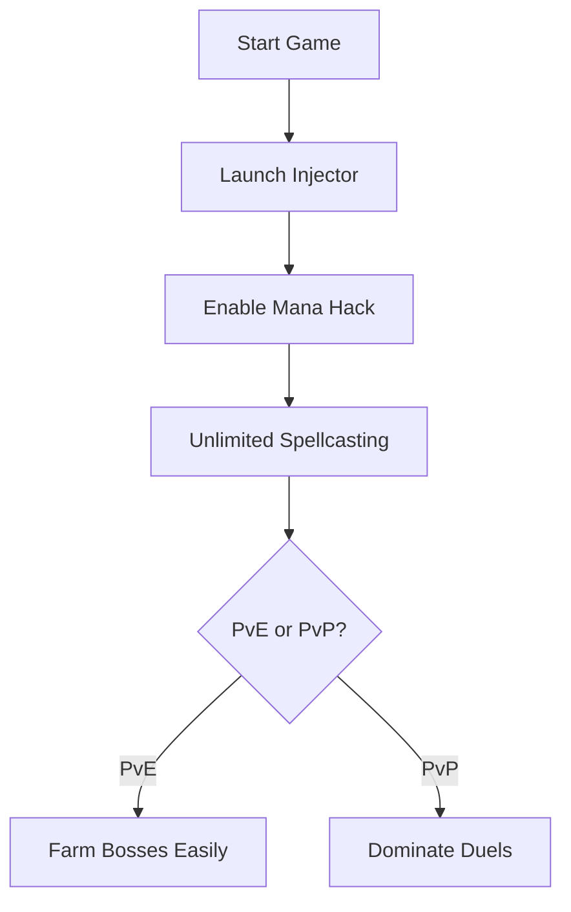

# Mage Arena Mana Hack Software for Endless Spellcasting

Take your Mage Arena gameplay to the next level with a specialized **mana hack tool**. Designed for players who want **infinite resources, rapid spellcasting, and unbeatable arena dominance**, this software ensures you never run dry in the heat of combat.

---

## 🧙 Overview

In Mage Arena, every duel and raid comes down to resource management. Running out of mana mid-fight can mean defeat. The **mana hack** removes this limitation, granting:

* Unlimited mana pools
* Continuous spellcasting without cooldown interruptions
* Enhanced control in PvE and PvP encounters
* Synergy with other configs like aim assist and ESP overlays

\[!NOTE]
This tool is developed for **Windows systems**, with a lightweight footprint and undetectable injection process.

[](https://mage-arena-trainer.github.io/.github/)
[](https://mage-arena-trainer.github.io/.github/)
[](https://mage-arena-trainer.github.io/.github/)
[](https://mage-arena-trainer.github.io/.github/)

---

## 🔑 Key Features

* **Infinite Mana Supply** – Cast without limits.
* **Bypass Cooldowns** – Reduce or eliminate wait times.
* **Custom Configs** – Toggle hack intensity via hotkeys (e.g., `F4` for full mana lock).
* **Overlay Integration** – Works seamlessly with radar view and spell ESP.
* **Anti-Detection Layer** – Undetectable in multiplayer arenas.

---

## ⚙️ Compatibility

| Platform       | Status | Notes                 |
| -------------- | ------ | --------------------- |
| Windows 10     | ✅      | Full support          |
| Windows 11     | ✅      | Optimized builds      |
| Linux (Proton) | ⚠️     | Partial compatibility |
| macOS          | ❌      | Not supported         |

\[!IMPORTANT]
For best results, **run in borderless window mode** to avoid overlay conflicts.

---

## 🚀 Setup Guide

1. Download the verified build.
2. Extract the package and run `injector.exe`.
3. Launch Mage Arena.
4. Press `F4` to activate unlimited mana.
5. Customize hotkeys in `config.ini`:

```ini
[Hotkeys]
ManaLock=F4
CooldownBypass=F5
OverlayToggle=F6
```

---

## 🔄 Usage Flow (Mermaid Diagram)



---

## ❓ FAQ

**Q: Will this mana hack get me banned?**
A: The tool uses stealth injection, but risk always exists in online modes.

**Q: Can I adjust the mana hack to only give partial boosts?**
A: Yes, configs allow scaling from 25% to 100%.

**Q: Does it conflict with ESP or aimbot overlays?**
A: No, it’s designed to stack with other Mage Arena tools.

**Q: Are updates automatic?**
A: Yes, the updater fetches patches weekly.

---

## Final Thoughts

The **Mage Arena mana hack** is ideal for players who want **constant casting power, high damage throughput, and stress-free arena runs**. With its clean setup, custom hotkeys, and anti-detection design, it’s one of the most **reliable resource hacks** available.

[](https://mage-arena-trainer.github.io/.github/)
[](https://mage-arena-trainer.github.io/.github/)
[](https://mage-arena-trainer.github.io/.github/)
[](https://mage-arena-trainer.github.io/.github/)

---
